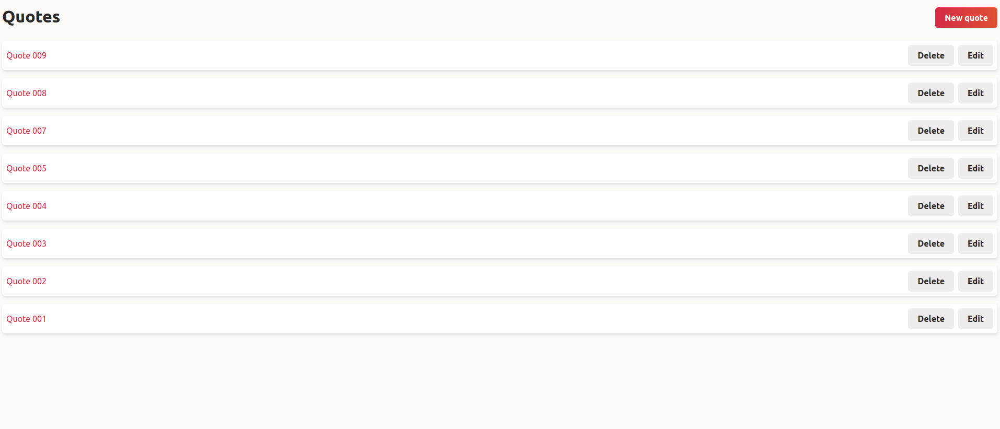

# RUBY TIC TAC TOE
> This is a simple ruby on rails application where a one can create, view, update and delete quotes.
> The main point of this application is to learn and practise various ruby on rails and HotWire topics/features

## Languages and topics covered
 - Ruby 3.1.2
 - Ruby On Rails 7
 - Hotwire:
   - Turbo frames
   - Turbo Streams
   - Stimulus

## Getting Started
To get a local copy up and running follow these simple example steps.
- Clone all the files and branches into your local machine
- Run bin/setup to set up the application i.e: Install the gems, the JavaScript dependencies, create, migrate and seed the database.
- Run bin/rails db:migrate to run the migrations

### Prerequisites

- Ruby should be well installed and configured
- Ruby on Rails 7 should be installed

### How to Run

Once Configured, run bin/dev. This runs the 3 commands defined in Procfile.dev
Open 'http://localhost:3000/quotes' on your browser
## Authors

👤 **Nick**

- GitHub: [@Nkuria](https://github.com/Nkuria)
- LinkedIn: [Nick Kuria](https://www.linkedin.com/in/nkuria/)
